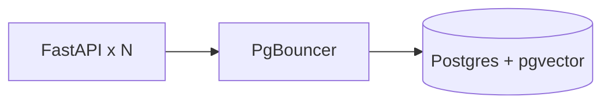
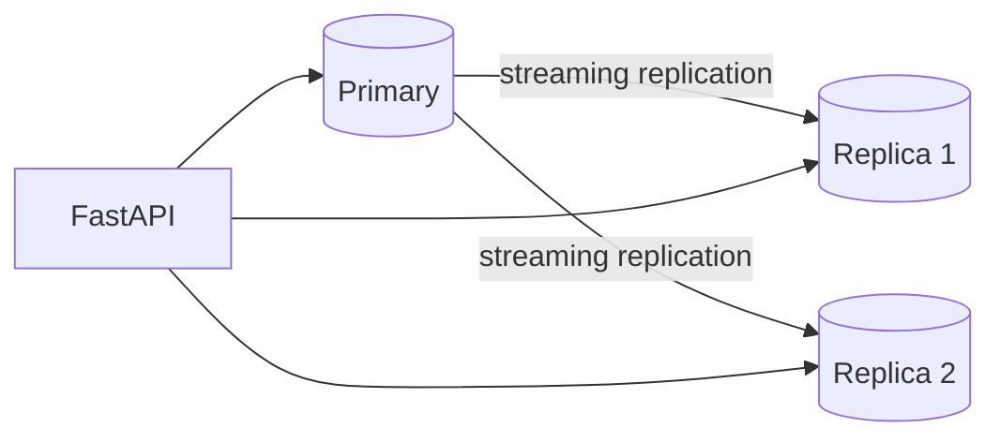
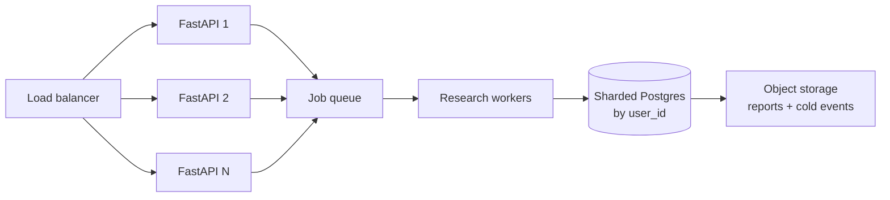

# Database design & scaling roadmap

Target: a user-tenanted research platform that stays correct and fast from one
user to ChatGPT-class scale (millions of users). The schema is designed so each
scale step is a migration/infra change — never a rewrite.

## Current schema (ER)

```mermaid
erDiagram
    users ||--o| user_settings : "1:1 preferences"
    users ||--o{ auth_sessions : "signs in via"
    users ||--o{ user_memories : "remembers"
    users ||--o{ documents : "uploads"
    users ||--o{ research_runs : "owns"
    users ||--o{ conversations : "chats in"
    conversations ||--o{ messages : "contains"
    research_runs |o--o| conversations : "spawned from"
    documents ||--o{ document_chunks : "chunked into"
    research_runs ||--o{ plan_steps : "run_id"
    research_runs ||--o{ subagent_tasks : "run_id"
    research_runs ||--o{ sources : "run_id"
    research_runs ||--o{ run_events : "run_id"
    research_runs ||--o{ run_followups : "chat with report"
    plan_steps |o--o{ subagent_tasks : "plan_step_id"
    research_runs |o--o{ user_memories : "origin_run_id"

    users {
        uuid id PK
        varchar email UK "lowercased"
        varchar password_hash "nullable, OAuth-ready"
        varchar display_name
        boolean is_active
        timestamptz created_at
        timestamptz updated_at
    }
    auth_sessions {
        uuid id PK
        uuid user_id FK
        varchar token_hash UK "sha256 of refresh token"
        timestamptz expires_at "indexed"
        timestamptz revoked_at
    }
    user_settings {
        uuid user_id PK "FK users"
        jsonb settings "default model, report style, ..."
    }
    user_memories {
        uuid id PK
        uuid user_id FK
        text content
        varchar source "manual|auto"
        uuid origin_run_id FK "provenance for auto memories"
        boolean is_active
    }
    documents {
        uuid id PK
        uuid user_id FK
        varchar filename
        bigint size_bytes
        char sha256 "dedupe per user"
        text storage_key "object storage pointer"
        varchar status "pending|processing|ready|failed"
        int page_count
    }
    document_chunks {
        uuid id PK
        uuid document_id FK
        uuid user_id FK "denormalized for tenant-scoped retrieval"
        int chunk_index "unique per document"
        text content
        int token_count
        int page_number
    }
    research_runs {
        uuid id PK
        uuid user_id FK
        text question
        varchar status "planning|awaiting_approval|running|paused|done|failed"
        jsonb plan
        text report
        jsonb report_json
        varchar model
        timestamptz created_at
        timestamptz finished_at
        text error
    }
    plan_steps {
        uuid id PK
        uuid run_id FK
        int step_order "unique per run"
        text description
        varchar status "pending|active|done|failed"
        jsonb searches
    }
    subagent_tasks {
        uuid id PK
        uuid run_id FK
        uuid plan_step_id FK "nullable"
        text objective
        varchar status
        text findings
        jsonb sources
        int tokens_used
    }
    sources {
        uuid id PK
        uuid run_id FK
        text url
        text title
        text snippet
        int first_seen_step
        varchar credibility_hint
    }
    run_events {
        uuid id PK
        uuid run_id FK
        timestamptz ts
        varchar type "plan|search|read|think|subagent_start|subagent_done|synthesis|citation|error|interrupt"
        jsonb payload
    }
    run_followups {
        uuid id PK
        uuid run_id FK
        uuid user_id FK
        text question
        text answer
        int tokens_used
        timestamptz created_at
    }
    conversations {
        uuid id PK
        uuid user_id FK
        varchar title "auto-generated after first exchange"
        timestamptz created_at
        timestamptz updated_at
    }
    messages {
        uuid id PK
        uuid conversation_id FK
        uuid user_id FK "denormalized for tenancy filters"
        varchar role "user|assistant|system"
        text content
        varchar model "set on assistant messages"
        int tokens_used
        timestamptz created_at
    }
```

### Tenancy rules (enforced in the data model)

1. **Every user-owned row carries `user_id`** — including `document_chunks`,
   where it is *denormalized on purpose*: tenant-scoped retrieval (and later
   tenant-filtered vector search) must filter by user without a join.
2. **Deletes cascade from `users`** — account deletion removes every trace
   (runs, docs, chunks, memories, sessions), which GDPR-style erasure needs.
3. **Ownership is checked at query time** — every app query filters by the
   authenticated `user_id`; the DB layout makes those filters index-covered.
4. **`user_memories` has provenance** (`source` manual/auto + `origin_run_id`)
   — memories are auditable and editable, not a black box.

### Access patterns (what queries must be fast)

| Pattern | Query shape | Served by |
| ------------------------------ | ------------------------------------ | --------------------------------- |
| My runs / history              | `WHERE user_id=? ORDER BY created_at DESC` | `ix_research_runs_user_created_at` |
| Run list / admin               | `WHERE status=… ORDER BY created_at` | `ix_research_runs_status_created_at` |
| Live SSE feed (polled)         | `WHERE run_id=? AND ts>last` on run_events | `ix_run_events_run_id_ts` |
| Plan view                      | steps of a run, in order             | `ix_plan_steps_run_id` + `uq_plan_steps_run_order` |
| Report sources sidebar         | sources of a run, most-cited         | `ix_sources_run_id` |
| My documents                   | `WHERE user_id=? ORDER BY created_at DESC` | `ix_documents_user_created_at` |
| My conversations (sidebar)     | `WHERE user_id=? ORDER BY updated_at DESC` | `ix_conversations_user_updated_at` |
| Load chat history              | `WHERE conversation_id=? ORDER BY created_at` | `ix_messages_conversation_created_at` |
| Active memories for a prompt   | `WHERE user_id=? AND is_active`      | `ix_user_memories_user_active` (partial) |
| Session validation / cleanup   | `WHERE token_hash=?` / `WHERE expires_at<?` | unique index / `ix_auth_sessions_expires_at` |

### Scale-proof decisions already made

- **UUID PKs** — no autoincrement hotspots, rows can be created on any shard.
- **FK columns indexed** — Postgres does not auto-index FKs; every child lookup
  and every cascade delete stays fast.
- **`run_events` is append-only** with a composite `(run_id, ts)` index — the
  future partition key is already in the schema.
- **Statuses are varchar + app-level enums** — changing enumerations never
  requires locking ALTERs on a huge table.
- **JSONB for flexible payloads** (plan, settings, event payloads) — structure
  evolves without migrations.
- **File bytes live in object storage**, DB rows are metadata + pointers — the
  DB never becomes a blob store.
- **pgvector is installed** (compose runs `pgvector/pgvector:pg16`) — embedding
  columns land later as a plain `ADD COLUMN`, no infra change.

## Scaling roadmap — one step at a time

### Step 1 — Schema hardening ✅

Indexes and constraints for the research pipeline (migrations `c14d7c0be434`,
`7f7304112143`).

### Step 2 — Multi-tenancy: users, context, ownership ✅

`users`, `auth_sessions`, `user_settings`, `user_memories`, `documents`,
`document_chunks`, `run_followups`; `research_runs.user_id` + user-owned
indexes (migrations `654094b659d2`, `4911c47b165f`). Verified: tenant-scoped
counts, per-user SHA-256 dedupe, full cascade erasure from `users`.

Personal context model:
- **Conversations + messages** = free-form ChatGPT-style chat. Runs can be
  spawned from a conversation (`research_runs.conversation_id`, SET NULL on
  conversation delete — runs outlive chats). Messages are append-only with
  per-message token accounting; title is auto-generated after the first
  exchange. Report-grounded Q&A stays separate (`run_followups`).
- **Documents** = uploaded files (PDF/MD/TXT…): metadata + storage key + per-user
  content dedupe + processing status machine (`pending → processing → ready|failed`).
- **Document chunks** = retrieval units, tenancy-denormalized; embedding column
  arrives with the RAG step (dimension depends on the embedding model chosen).
- **User memories** = cross-run facts with provenance; only active ones are
  injected into prompts.

### Step 3 — Connection pooling + tuned engine (next)

FastAPI async workers each need a DB connection; unbounded at scale.

- PgBouncer (transaction mode) in front of Postgres, or tuned SQLAlchemy pool
  (`pool_size`, `max_overflow`, `pool_recycle`) via env config.
- Postgres `max_connections` stays low (~100); the app multiplexes through it.

### Step 4 — Read replicas

Report reads and run-history lists go to replicas; writes stay on primary.

- Route at the session level (`core/database.py` chooses engine per query).
- SSE polling still hits the primary (needs fresh events) but becomes a cheap
  indexed range scan.

### Step 5 — Partition `run_events` (and later `sources`)

`run_events` is the write-amplified table (every search/read/think of every
subagent). Partition by monthly `ts` range; the `(run_id, ts)` index already
matches. Old partitions detach to cold storage in milliseconds.

- Retention: hot = 90 days, cold = object storage (S3) as parquet/JSONL.
- `sources`/`subagent_tasks` follow only if they grow into the hundreds of GB.

### Step 6 — Caching + heavy-payload offload

- Report markdown/JSON: store in object storage once runs exceed a size
  threshold; keep a row stub + storage pointer in the DB.
- Cache hot report pages (Redis) — reports are immutable once `done`, so
  cache-invalidation is trivial.

### Step 7 — True horizontal scale (ChatGPT class)

- Shard by `user_id` (Citus or app-level routing); UUID keys and
  per-run-contained joins (no cross-run queries) make co-location natural.
- Job queue for research pipelines (BullMQ-style worker pool) instead of
  in-process asyncio jobs.
- Per-user quotas/rate limits enforced in a dedicated table.

### What we deliberately do NOT do yet

- No sharding until replicas + partitioning saturate (they carry you to very
  large scale with a fraction of the complexity).
- No microservices — one FastAPI app scales behind a load balancer.
- No polyglot persistence — Postgres (+pgvector) covers rows, JSON, and vectors.

## Migrations log

| Migration | Content |
| --------------------- | ----------------------------------------- |
| `c14d7c0be434` | Create the five research-run tables |
| `7f7304112143` | FK indexes, `(status, created_at)`, `(run_id, ts)` composite, unique `(run_id, step_order)` |
| `654094b659d2` | Enable pgvector extension |
| `4911c47b165f` | Users, sessions, settings, memories, documents + chunks, follow-ups; `research_runs.user_id` |
| `78025e7a54a8` | Conversations + messages; `research_runs.conversation_id` |
